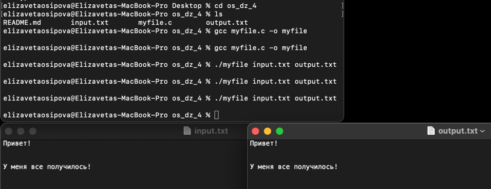

# Осипова Елизавета Владимировна - БПИ219

## Домашнее задание №5

#### Задание: 
1. Разработать программу использующую для работы с текстовыми файлами системные вызовы. Программа на языке C должна прочитать, используя буфер, размер которого превышает читаемые файлы и записать прочитанный файл в файл с другим именем. Имена файлов для чтения и записи задавать с использованием аргументов командной строки.<br>
2. Опционально +1. Использовать для работы с файлами буфер ограниченного размера, требующий циклического использования.<br>
3. Опционально +1. Читать и переписывать не только текстовые, но и исполняемые файлы, включая скрипты, которые сохраняют режим доступа, обеспечивающий их запуск. При этом обычные текстовые файлы запускаться не должны.<br>

#### Решение:

Вот пример программы на C, которая использует системные вызовы для чтения текстового файла и записи содержимого в новый файл с другим именем. Программа принимает имена входных и выходных файлов в качестве аргументов командной строки и использует буфер ограниченного размера для чтения и записи файлов.

Программа - [myfile.c](myfile.c)

Файл с входными данными - [input.txt](input.txt)

Файл с выходными данными - [output.txt](output.txt)

Каждая программа содержит комментарии с пояснениями. 

Чтобы скомпилировать программу, выполните следующую команду в терминале:<br>

```
gcc myfile.c -o myfile
```

Чтобы использовать программу, передайте имена входных и выходных файлов в качестве аргументов командной строки:<br>

```
./myfile input.txt output.txt
```

Это позволит прочитать содержимое input.txt и напишите их на output.txt . Режим доступа к выходному файлу будет установлен таким образом, чтобы он соответствовал режиму доступа к входному файлу.

Программа может использоваться для чтения и перезаписи не только текстовых файлов, но и исполняемых файлов и скриптов. Однако обычные текстовые файлы запускать не следует. Программа только считывает и записывает файлы и не запускает никаких исполняемых файлов или скриптов.

Пример работы:

