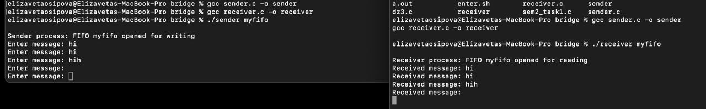

# Осипова Елизавета Владимировна - БПИ219

## Домашнее задание №5

#### Задание: 
Разработать программы, реализующие двусторонний обмен данными по именованным каналам. То есть организовать их взаимодействие как независимых процессов. Имена каналов для обмена сообщениями передавать через аргументы командной строки.


#### Решение:

Вот две программы, одна для отправителя, а другая для получателя, которые реализуют двусторонний обмен данными по именованным каналам на C с использованием каналов. Имена каналов для обмена сообщениями передаются через аргументы командной строки.

Sender program - [sender.c](sender.c) <br>

Receiver program - [receiver.c](receiver.c)

Каждая программа содержит комментарии с пояснениями. 

Чтобы скомпилировать программы, выполните следующие команды в терминале:<br>

```
gcc sender.c -o sender
gcc receiver.c -o receiver
```

Чтобы запустить программы, откройте два окна терминала и выполните следующие команды.<br>

В первом окне:
```
./sender myfifo
```
Во втором окне:
```
./receiver myfifo
```

Замените <b>_`myfifo`_</b> именем именованного канала, который вы хотите использовать для обмена сообщениями. Вы можете использовать любое имя, которое вам нравится, при условии, что оно одинаково для обеих программ.

После запуска программ вы можете вводить сообщения в окне отправителя, и они будут отправлены в окно получателя по именованному каналу. Чтобы выйти из программ, введите "exit" в окне отправителя.

Пример работы:

